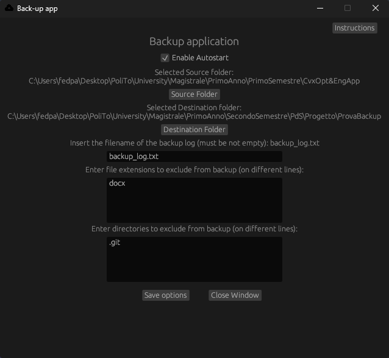
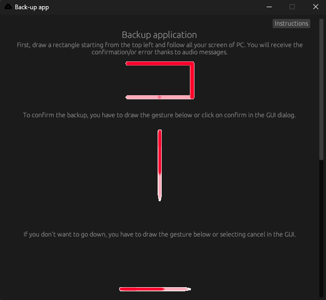
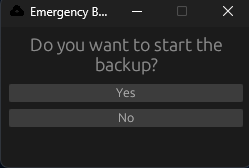

# Emergency Backup

# Backup Application in Rust

This Rust application is designed to perform backups on a PC, especially in scenarios where the screen is not accessible. The application is triggered via specific mouse gestures and runs in the background with minimal CPU consumption. It can be used to back up data to an external drive (such as a USB flash drive), and logs both CPU usage and backup details.

## Features

- **Backup Activation via Mouse Gesture**: 
  - The user can trigger a backup by performing a specific mouse gesture on the screen.
  
- **Configurable Backup Source**:
  - The source of the files to be backed up can be specified in a configuration file. This allows for flexibility in selecting which files or directories are included in the backup.
  - Multiple backup types are supported, such as backing up the contents of a folder or files of a specific type.

- **Confirmation Window**:
  - After the backup activation gesture is recognized, a confirmation window will be displayed on the screen and also provided an audio to let know what happen to the user.

- **Low CPU Usage**:
  - The application is optimized to run with minimal CPU usage.
  - Every 2 minutes, the application logs its CPU consumption to a file for monitoring purposes.

- **Backup Logging**:
  - Once the backup is completed, a log file is created on the USB drive. This file includes details such as the total size of the backed-up files and the CPU time used to complete the backup.

- **Background Operation**:
  - The application runs in the background and is installed during the PC's bootstrap process, ensuring that it starts automatically when the computer boots up in different enviroment.

## Usage

1. **Configuration**: 
   - Edit the configuration file to specify the source and the destination of the backup.
   - Specify what directories/extensions to exclude
   - Launch the application using the option `--config` to start the configuration GUI

2. **Triggering a Backup**:
   - To initiate a backup, perform the rectangle mouse gesture
   - Confirm the backup by performing the confirmation gesture using '∧' and to cancel using '∨' or using the gui
   
3. **Monitoring**:
   - The application logs its CPU usage every 2 minutes. These logs can be found in the designated log file.
   - After a backup completes, the log file on the USB drive will include the total size of the backup and the CPU time used.

## Group 3

This project was developed by **Group 3** as part of our coursework. We collaborated to design and implement a Rust application that provides a robust solution for performing backups with minimal system impact.
| [Olivero Giacomo](mailto:giacomo.olivero@studenti.polito.it) | [Paglialunga Federico](mailto:s328876@studenti.polito.it) | [Pellegrino Davide](mailto:s323013@studenti.polito.it) |

## Screenshot 

**Configuration**

 

The backup app's GUI lets you configure settings easily. 
It features an "Instructions" button that shows GIFs explaining key actions like starting, confirming, or canceling backups. You can choose the source and destination folders, name the backup log, and exclude specific file types or directories. There's a checkbox to enable autostart, and a "Save options" button to store your settings with feedback.
A "Close Window" button exits the app.

The "Instructions" section in the backup app's GUI displays animated GIFs with short explanations for key actions. 
It shows how to start a backup, confirm it, or cancel it, guiding the user through each step visually. The instructions are toggled on or off with a single button, making it easy to access help when needed.

**Confirmation POPUP**

The Confirm GUI is a simple pop-up that asks if you want to start the backup, with two buttons: "Yes" and "No." You can choose your option, and the window closes. If a gesture is used instead, the window automatically closes too. 
It's a quick way to confirm whether to proceed with the backup.

## License

This project is licensed under the MIT License. See the `LICENSE` file for more details.
